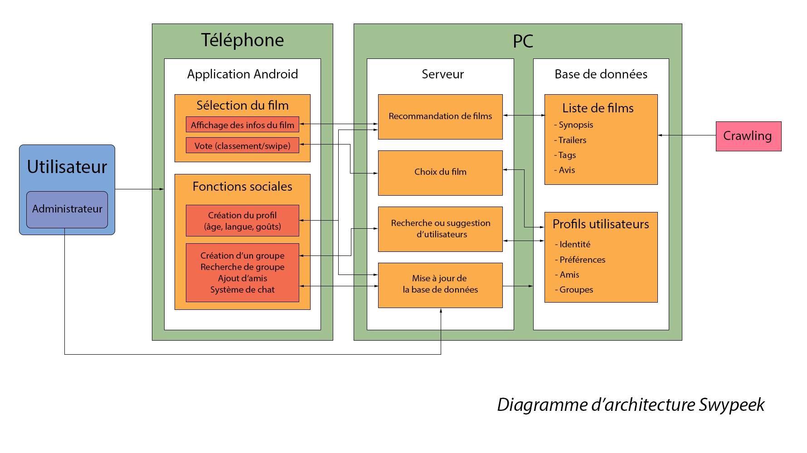
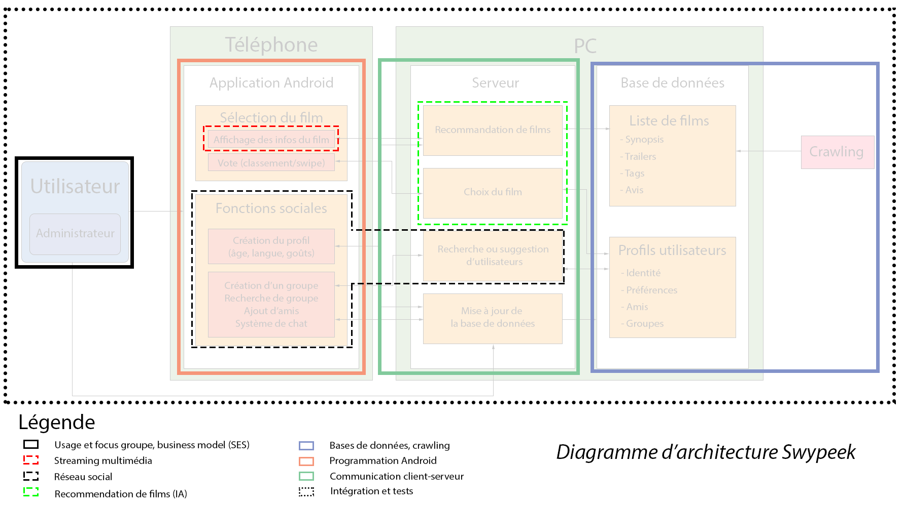

=== Schéma d’architecture

==== Description des blocs

Le schéma est constitué de 2 blocs principaux : Téléphone et PC. L’utilisateur interagit à l’aide de son téléphone via une application.

L’app a 2 fonctions essentielles : sélection du film et réseau social. Le PC est constitué de 2 unités : serveur et base de données.

Crawling : alimentation de la base de données des films à l’aide de recherches sur le web ou à partir de BDD existantes.

La liste de film nourrit l’algorithme de recommandation qui sélectionne les films pertinents qui seront affichés sur les écrans de téléphones des utilisateurs lors du processus de sélection.

Le réseau social suggère de mettre en relation des individus ayant des profils présentant des similitudes.

Les choix de films permettent d’affiner les profils utilisateur. 

Il faut ici une description textuelle de chaque bloc, sa fonction
détaillée. En général, un bloc correspond à un module, sauf exception.
Il peut être adapté de faire des blocs plus petits qu’un module.

Il est important ici de distinguer les bibliothèques identifiées et
disponibles de ce que vous allez produire (coder) vous même. Vous ne
devez pas réinventer la roue mais vous ne devez pas non plus avoir votre
projet tout fait en encapsulant un programme déjà existant.

===== NomBloc1

Description textuelle du bloc 1.

===== NomBloc2

Description textuelle du bloc 1.
